# pdfkit

[](https://github.com/sponsors/viveknaskar)

Free, open-source PDF tools that run entirely in your browser. No watermarks, no sign-up, no server uploads — your files never leave your device.

Built with vanilla JavaScript, [pdf-lib](https://pdf-lib.js.org/), [PDF.js](https://mozilla.github.io/pdf.js/), and [Vite](https://vitejs.dev/).

---

## Screenshots

### Home

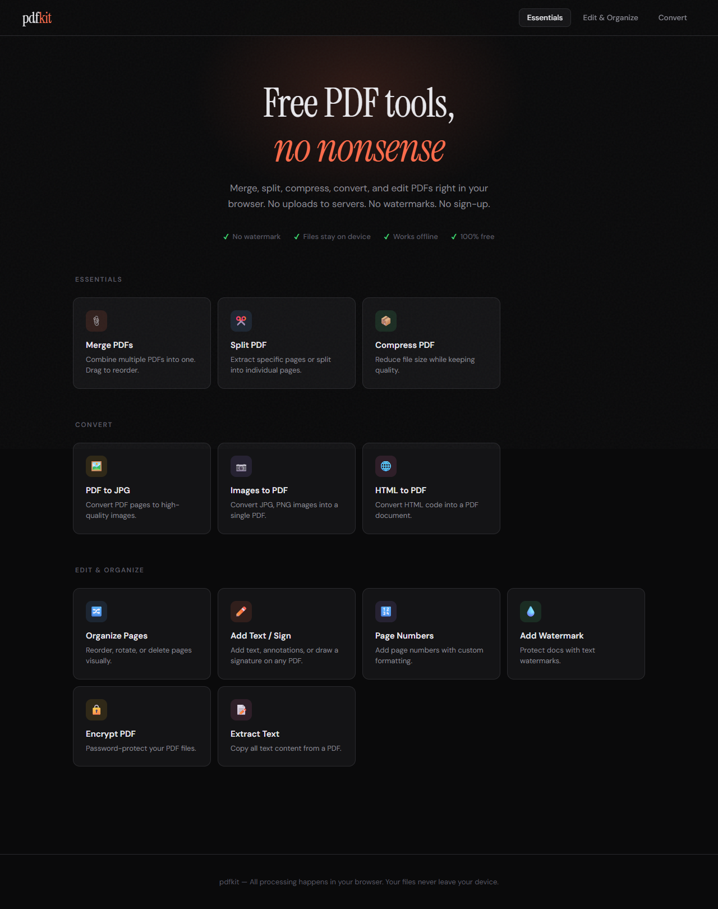

### Essentials

| Merge PDFs | Split PDF | Compress PDF |
|:---:|:---:|:---:|
| 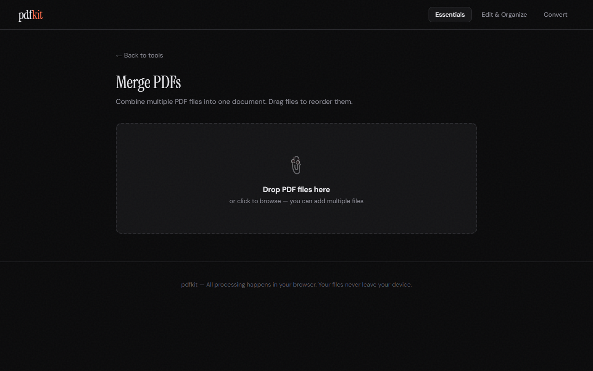 | 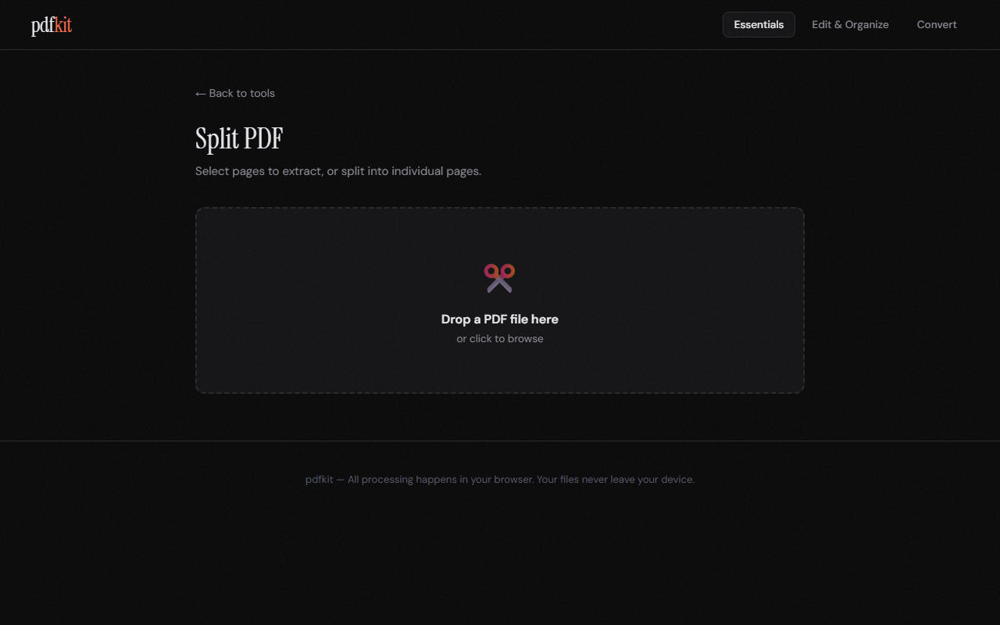 | 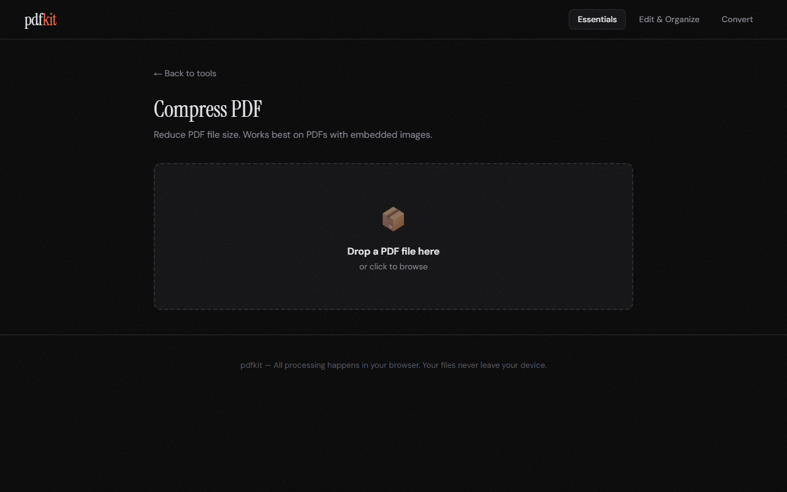 |

### Convert

| PDF to JPG | Images to PDF | HTML to PDF |
|:---:|:---:|:---:|
| 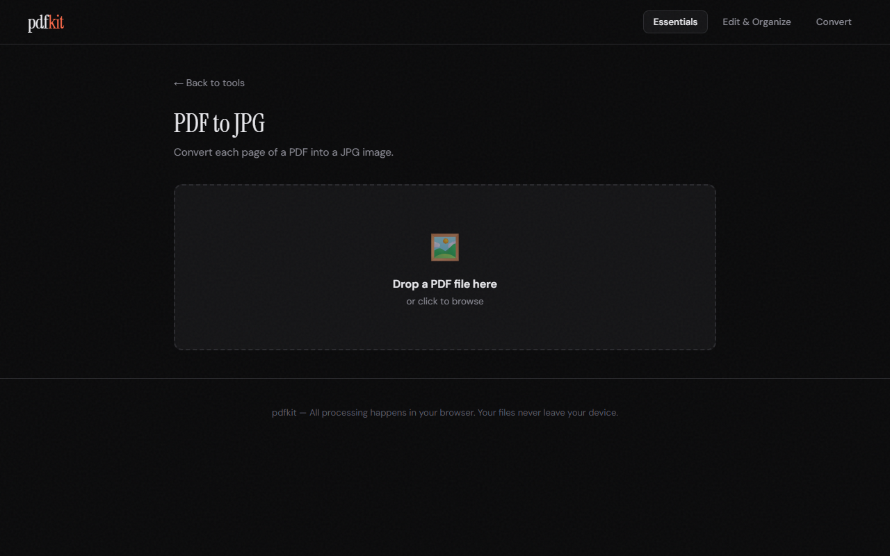 | 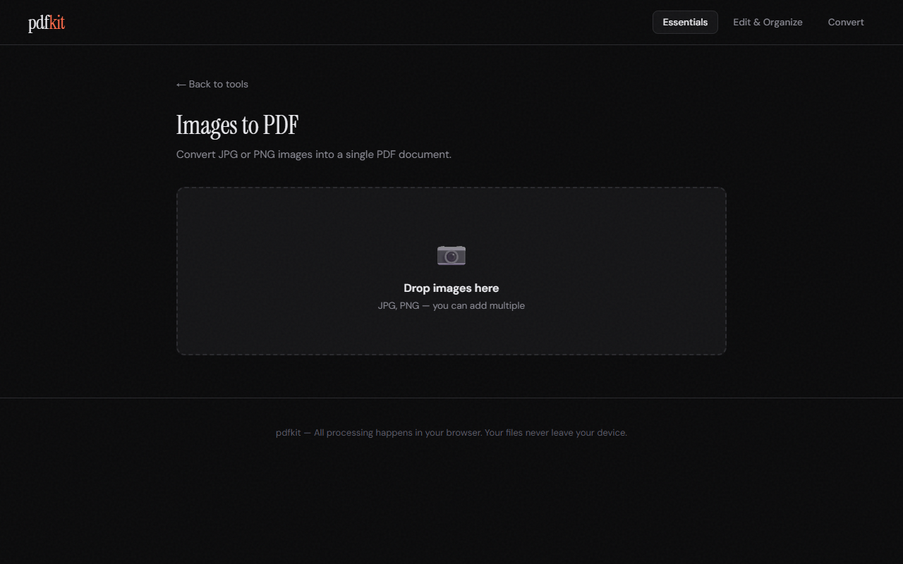 | 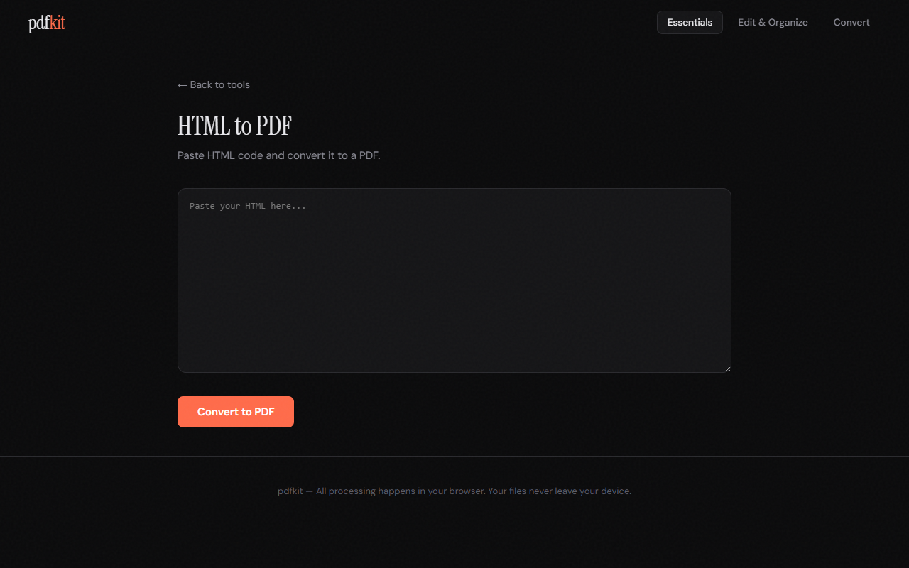 |

### Edit & Organize

| Organize Pages | Add Text / Sign | Page Numbers |
|:---:|:---:|:---:|
| 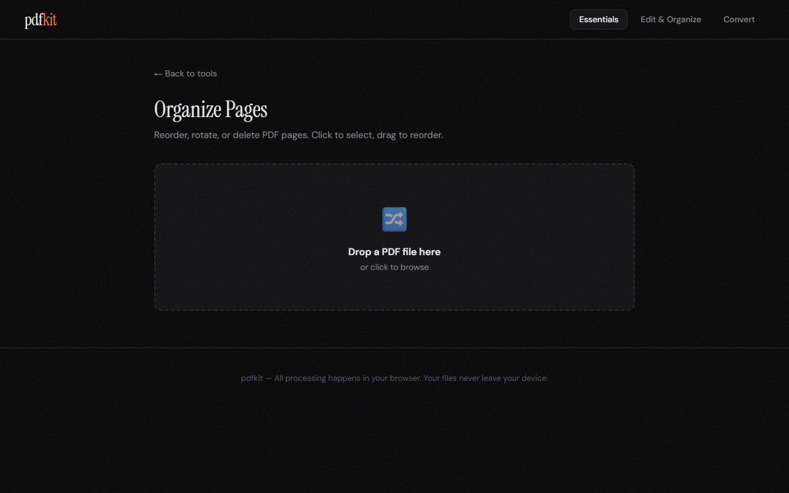 | 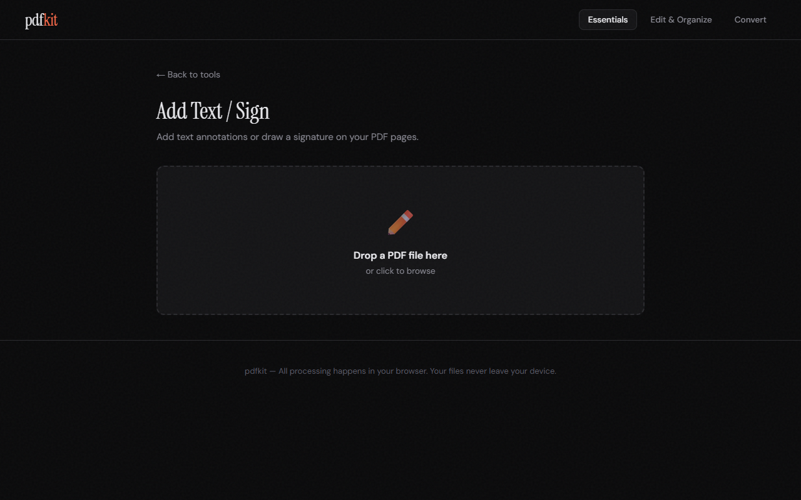 | 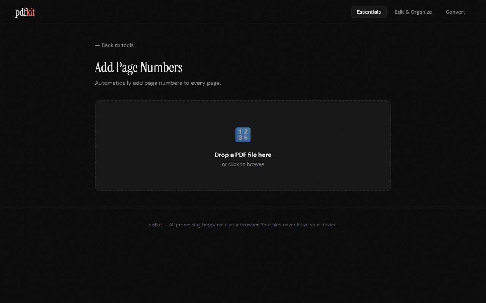 |

| Add Watermark | Encrypt PDF | Extract Text |
|:---:|:---:|:---:|
| 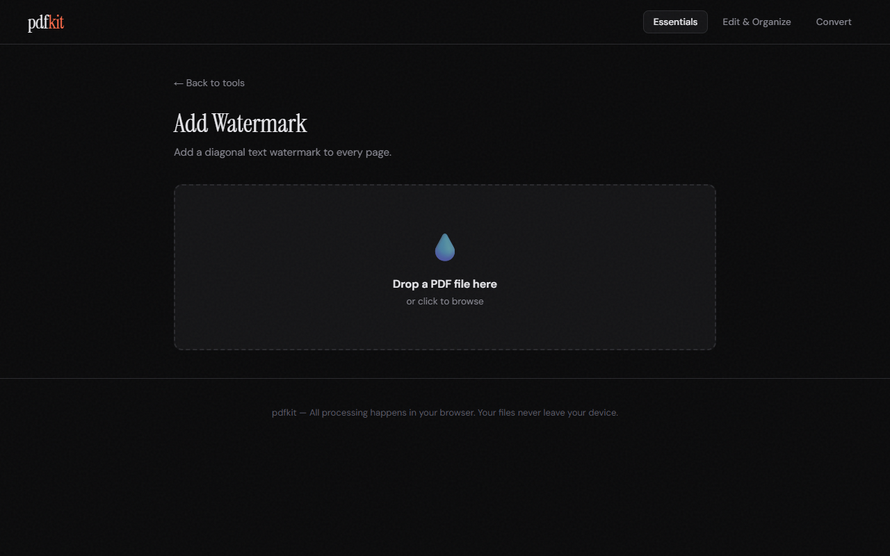 | 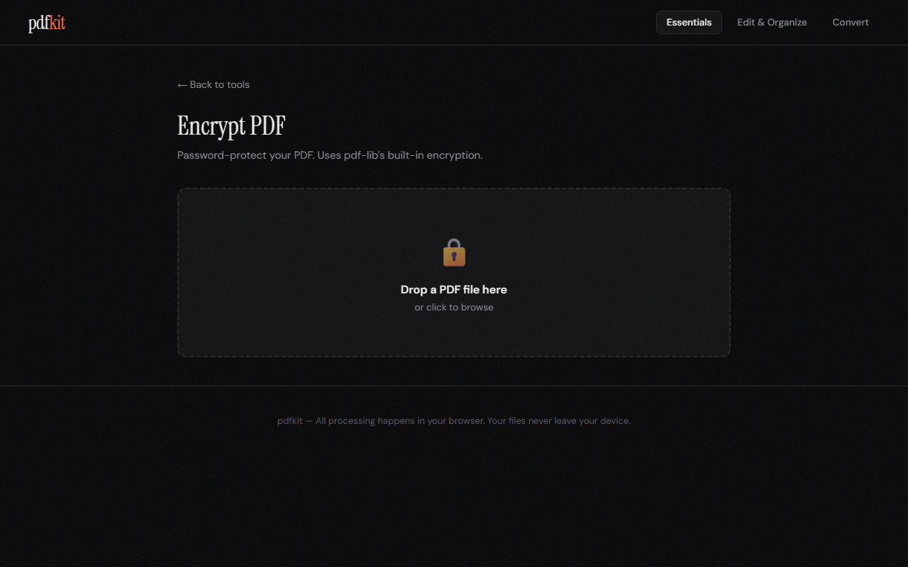 | 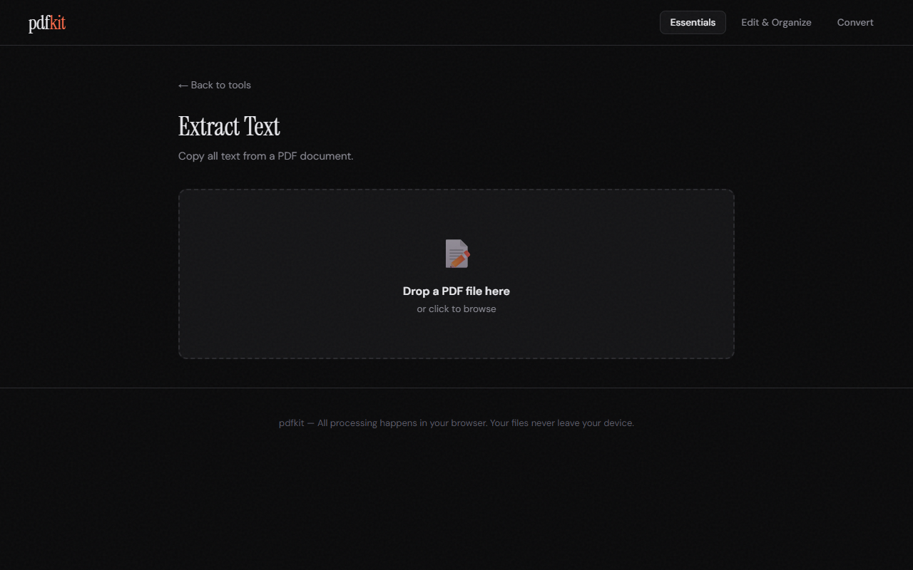 |

---

## Features

- **100% client-side** — all processing happens in the browser using WebAssembly and Canvas APIs
- **No file uploads** — files are read and written locally; nothing is sent to any server
- **Works offline** — once loaded, the app functions without an internet connection
- **No watermarks, no sign-up, no limits**
- **Drag & drop** support across all tools

---

## Tools

### Essentials

| Tool | Description |
|------|-------------|
| **Merge PDFs** | Combine multiple PDF files into one. Drag to reorder before merging. |
| **Split PDF** | Extract selected pages or split every page into a separate PDF. Visual page picker included. |
| **Compress PDF** | Reduce file size. Most effective on PDFs with embedded images. |

### Convert

| Tool | Description |
|------|-------------|
| **PDF to JPG** | Render each PDF page as a JPG image. Choose Standard (72 DPI), High (150 DPI), or Maximum (216 DPI) quality. |
| **Images to PDF** | Combine JPG, PNG, or WebP images into a single PDF document. |
| **HTML to PDF** | Paste raw HTML and convert it to a downloadable PDF. |

### Edit & Organize

| Tool | Description |
|------|-------------|
| **Organize Pages** | Drag to reorder pages, rotate 90° CW/CCW, or delete pages with visual thumbnails. |
| **Add Text / Sign** | Click to place text annotations or freehand-draw a signature on any page. Supports color and font size controls, undo, and multi-page navigation. |
| **Page Numbers** | Add page numbers with configurable position (top/bottom, left/center/right), format (plain, dash, "Page N", "N of M"), and starting number. |
| **Add Watermark** | Stamp a diagonal text watermark on every page. Configurable text and opacity (light 10%, medium 20%, heavy 35%). |
| **Encrypt PDF** | Password-protect a PDF using pdf-lib's built-in encryption. |
| **Extract Text** | Extract all text content from a PDF and copy it to the clipboard. |

---

## Tech Stack

| Library | Role |
|---------|------|
| [pdf-lib](https://pdf-lib.js.org/) | Create and modify PDFs (merge, split, annotate, encrypt, watermark, page numbers) |
| [pdfjs-dist](https://mozilla.github.io/pdf.js/) | Render PDF pages to canvas (previews, PDF to JPG, text extraction) |
| [Vite](https://vitejs.dev/) | Dev server, ES module bundler, and production build tool |

No frontend framework — plain HTML, CSS, and ES modules.

---

## Requirements

- [Node.js](https://nodejs.org/) v18 or later (v24 LTS recommended)
- npm (bundled with Node.js)

---

## Setup

```bash
# Install dependencies
npm install

# Start the dev server
npm run dev
```

Opens automatically at `http://localhost:3000`.

## Production Build

```bash
npm run build
```

Output goes to `dist/`. This is a fully static folder — deploy it anywhere.

```bash
# Preview the production build locally
npm run preview
```

---

## Project Structure

```
pdf-kit/
├── public/
│   └── robots.txt
├── src/
│   ├── assets/
│   │   └── icons/
│   ├── styles/
│   │   ├── base.css          # CSS reset, variables, typography
│   │   ├── layout.css        # Header, footer, hero, tool grid
│   │   ├── components.css    # Cards, buttons, dropzones, progress bars
│   │   └── tools.css         # Canvas editor, page previews, toolbars
│   ├── core/
│   │   ├── App.js            # App shell HTML, routing, navigation
│   │   ├── DropZone.js       # Drag-and-drop file handling
│   │   └── Utils.js          # Shared utility functions
│   ├── tools/
│   │   ├── MergePdf.js
│   │   ├── SplitPdf.js
│   │   ├── CompressPdf.js
│   │   ├── PdfToJpg.js
│   │   ├── ImagesToPdf.js
│   │   ├── HtmlToPdf.js
│   │   ├── OrganizePages.js
│   │   ├── AddTextSign.js
│   │   ├── PageNumbers.js
│   │   ├── AddWatermark.js
│   │   ├── EncryptPdf.js
│   │   └── ExtractText.js
│   └── main.js               # Entry point — imports and initializes all tools
├── index.html
├── package.json
├── vite.config.js
└── .gitignore
```

---

## Adding a New Tool

1. Create `src/tools/YourTool.js` and export an `init()` function that binds event listeners
2. Add the tool view HTML inside `toolViewsHTML()` in `src/core/App.js`
3. Add a tool card to the appropriate section grid in the home view (also in `App.js`)
4. Import and call `init()` in `src/main.js`

---

## License

MIT
